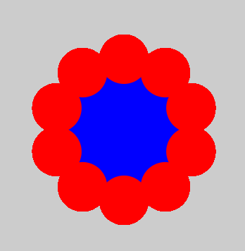
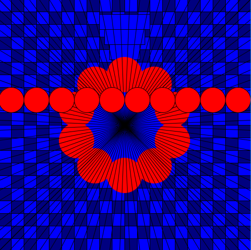
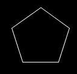
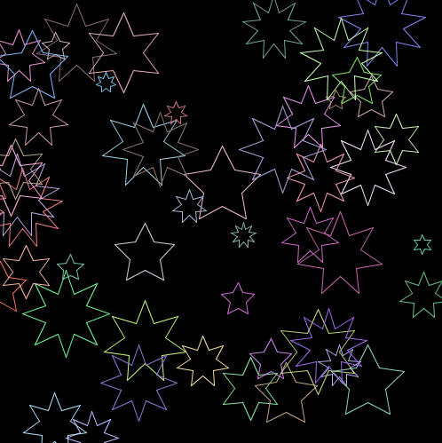

# DT508 Game Programming 2019-2020

Resources
---------
* [Processing](http://processing.org)
* [Processing reference](https://processing.org/reference/)
* [The Coding Train](https://www.youtube.com/channel/UCvjgXvBlbQiydffZU7m1_aw)
* [The Nature of Code](http://natureofcode.com/)
* [Games Fleadh](http://www.gamesfleadh.ie/)

## Past Exams
- [End of year Lab Test 2019](https://github.com/skooter500/GP-LabTest2-2019)
- [Supplemental Lab Test 2019](https://github.com/skooter500/gp2019-august-lab-test)
- [Supplemental Lab Test 2018](https://github.com/skooter500/GP-Autumn-Lab-Test-2018)
- [Lab Test 1 2016](https://github.com/skooter500/GP_Lab_Test_1)
- [Supplemental lab test 2 2016](https://github.com/skooter500/DT508-Lab-Test-Supplemental-2016)
- [End of year lab test 2016 Solution](https://github.com/skooter500/DT508-Lab-Test-Solution-2016)
- [Lab Test 1 2015](https://github.com/skooter500/dt508_2015_labtest1)

## Contact the lecturer
* Email: bryan.duggan@tublin.ie
* Twitter: [@skooter500](http://twitter.com/skooter500)
* [My website & other ways to contact me](http://bryanduggan.org)

## Assignments

- 25 November 2019 Week 11 - Lab Test 15%
- 2 December 2019 Assignment 1 submission 15%
- Assignment 2 - TBC
- Assignment 3 - 20% - Week 10 Semester 2
- End of Year lab test - 30% - TBC 

### Semester 1 

# Week 12 - Lab Test

Instructions:
- Create a new blank Processing sketch and name it DXXXXXXYOUR_NAME. Replace DXXXXXX with your own student number and YOUR_NAME with your name
- Save your sketch regularly! Like every 5 minutes or so.
- You can use the [Processing reference](https://processing.org/reference/), but no other resources such as Google, Facebook etc and no collaboration!
- When you are done, go to http://classroom.google.com and sign up with the following code: okbrtfr. 
- You may need to login with your TU Dublin Student email address. You will see an assignment called Game Programming Lab Test 1 2019. 
- Upload your correctly named .pde file here! 
- Please ask if you need any help submitting your work or if you would like me to check your submission. 
- You can also email me your submission at bryan.duggan@tudublin.ie with a subject of "Game Programming Lab Test 1" and I suggest you email your submission to yourself as a backup.

This is a video of the sketch you will be making today (click the image to see the video):

[](https://www.youtube.com/watch?v=rQkRlW1GSPU)

What is happening:

Pizzas spawn off screen and move towards the pizza oven on the right. When a pizza is in the oven, the power light should change from green to red and the count of the number of pizzas cooked increases by one.
Notice also that raw pizzas are coloured white and cooked pizzas are coloured brown (210,180,140). 

Marking Scheme:

| Feature | Marks |
|---------|-------|
| Drawing & cooking the pizza | 30 marks |
| Drawing the oven | 20 marks |
| Pizza movement | 20 marks |
| Oven Power | 15 marks |
| Counting pizzas | 15 marks |

To get full marks in the test, you should use variables, the if statement, loops and functions in your solution. 

# Week 11 - Working on your assignments

# Week 10 - Game of Life

# Week 9 - Arrays

[](https://www.youtube.com/watch?v=5tSBbWySCC0)

## Lab
### Learning outcomes
- Learn how to allocate arrays
- Learn how to store values in arrays
- Practice iterating arrays

Here is the rainfall data recorded at the Dublin Airport over 12 months of 2010:

| Month | Amount in mm |
|-------|--------------|
| Jan | 45 |
| Feb | 37 |
| March | 55 |
| April | 27 |
| May | 38 |
| June | 50 |
| July | 79 |
| August | 48 |
| September | 104 |
| October | 31 |
| November | 100 |
| December | 58 |

Create a Processing sketch and do the following:

- Allocate two arrays for storing the month names and the rainfall data
- Calculate the average rainfall for that year
- Calculate the month with the highest rainfall
- Calculate the month with the lowest rainfall

Now see if you can write code to generate the following graphs of the rainfall data:

- A bar chart:

  

- A trend line:

  

Advanced:

Try and draw a pie chart!


Hint! for the bar chart, it might be useful to allocate a third array to hold the colours. You an use random colours so that every month has a different colour.

# Week 8 - Loops 2

## Lecture - More loops

## Lab
### Learning Outcomes
- Practice generating lots of different shapes with loops in processing
- Be creative and make something beautiful in code

Use a for loop, rect and HSB colours to draw this:


Use sin and cos to draw this:


Use a loop and the HSB colour space:


Use ellipse to draw this:


Use a nested loop (a loop inside a loop) to draw this:


# Week 7 - Review week

# Week 6 - Loops 1

## Lab
### Learning Outcomes
- Practice generating lots of different shapes with loops in processing
- Be creative and make something beautiful in code

Draw the following shapes. Use variables and loops in your solutions!

I'ts best to spend some time thinking about the variables and how they are changing before writing code:

These require ONE loop:


This shape draws lines from the sides that all meet in the middle. This can be done using one loop, but is better with two:


This sketch always draws 10 equally sized circles across the screen. This should work no matter what you set the screen size to. You should also declare a variable to hold the number of circles to draw so that if you change this number, the sketch should still work:


This sketch places circles around the outside of a bigger circle to make a flower pattern. Once you figure this out, you can modify it to do something cool with colours:



This sketch prints the numbers of the clock around in a circle:


This sketch requires you to put one loop inside another and also use a boolean variable, though there are other ways to do this:


This is what it looks like when all the above code is in one sketch:



Try and draw this using ONE for loop:


Write a sketch that can draw regular polygons like squares, pentagons, octogons etc:



Write a sketch that can draw stars like these:



# Week 5 - Bugzap

# Week 4 - The IF statement

# Week 3 - Using variables and trigonometric functions
- [Trigonometry problem set](https://1.cdn.edl.io/IDqRlI8C9dRkoqehbbdHBrcGT6m87gkCQuMKTkp0U7JvHvuG.pdf)

## Lab
### Learning Outcomes
- Use numeric variables in a sketch
- Use operatorts on variables
- Use trigonometry
- Make beautiful things

A person flying a kite has released 176m of string. The string makes an angle of 27° with the ground. How high is the kite? How far away is the kite horizontally?
Write a p5 sketch to draw and solve the problem.
  - Solve the problem on paper first
  - Make variables for stringLen, theta, kHeight, kDist and any other variables you need
  - Assign the values that you know to the variables
  - Write code to calculate the kith height and horizontal distance values
  - Write code to draw the scenario


You can use the function [text](https://processing.org/reference/text_.html) to print text to the screen and [nf](https://processing.org/reference/nf_.html) to format a number to a certain number of dp's. For example ```text("Price: " + nf(p, 10, 2), 10, 50)```. You can look these functions up in the Processing reference.

### Part 2 - Spiral Jam

Experiment with the spirals sketch and see what kind of crazy beautiful spirals you can make. Use variables for colour gradients, use different shapes etc etc.

# Week 2 - Using variables
### Learning Outcomes
- Practice drawing
- Learn how to use operators with variables

# Part 1

Here is a youtube video of 4 sketches you can program today:

[](https://www.youtube.com/watch?v=kPOFqXsLLeo)

In your solution use the following processing functions:
- fill
- rect
- ellipse
- background
- stroke
- noStroke

And the mouseX and mouseY varibles. You can also use the + - * / operators

# Part 2

[](https://www.youtube.com/watch?v=uvPVGiU-bn4)

What is happening:

- The ground takes up half the window size
- The spaceship is 100 pixels wide and is *centered* around the mouse position.
- The person starts at the right side of the screen and moved from right to left

Use variables wherever practical in your sketch and calculate positions and sizes relative to these variables.

Bonus!

There are few things you can try (but you will probably have to read ahead and figure out how the if statement works)

- Come up with a more beautiful looking spaceship and person
- Change the colours of everything
- Make a car that drives from left to right
- When the person reaches the left side of the screen, he should switch direction
- Make the lights on the spaceship flash different colours


# Week 1

## Lecture

[](http://www.youtube.com/watch?2VLaIr5Ckbs)

## Lab

### Learning Outcomes
- Enroll on Google Classroom
- Know good online resourses
- Check out previous student work
- Learn how to draw using Processing
- Become familiar with writing and running sketches

### Instructions
- Log onto [Google Classroom](http://classroom.google.com) and enroll on the module okbrtfr.
- Check out [the Processing reference](https://processing.org/reference/)
- Check out [The Coding Train](https://www.youtube.com/channel/UCvjgXvBlbQiydffZU7m1_aw)
- Check out [these Sci-Fi user interfaces made by last years OOP students](https://www.youtube.com/playlist?list=PL1n0B6z4e_E5RZYrubD2pcxq0qzGy-3vr)
- Check out [these music visualisers made in Processing by previous programming students](https://www.youtube.com/watch?v=jw5zXkg84A0&list=PL1n0B6z4e_E79Sl5I9Q7MlJk8tKjhHv_9)
- If you are curious, check out [some of my creature videos](https://www.youtube.com/watch?v=cW8s5i9dmqA&list=PL1n0B6z4e_E6jErrS0ScSCaVrN7KV729x)
- Look up the following methods in the p5 reference to make sure you are clear about the syntax and parameters:
    - noStroke
    - noFill
    - line
    - ellipse
    - rect
    - background
    - stroke
    - fill
    - size
    - arc
    - triangle

Write sketches to draw the following shapes:


